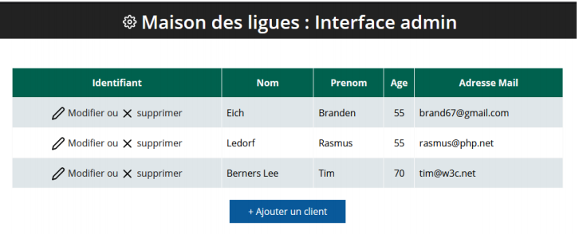
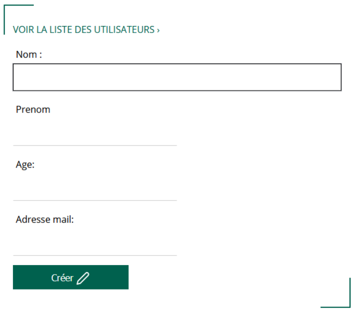
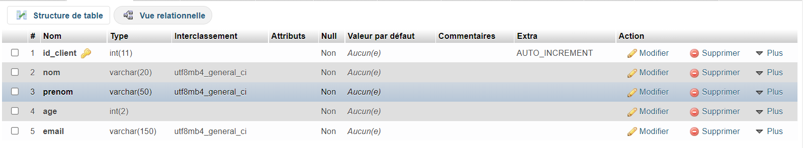

## Réaliser une interface admin gestion clients 

Cette partie de site admin a pour but de permettre aux administrateurs des Maisons des ligues, de recenser leurs clients. Pour ce faire, il faut créer une interface admin qui permet d’ajouter un client, modifier sont profile ou le supprimer

## Aspect fonctionnel
Vous devez créer toute la partie gestion. Pour les enregistrements à publier il faut créer une page avec un formulaire de 4 champs : Nom, Prénom, Age et adresse mail. Tous les champs sont obligatoires. Afficher un warning dans le cas l’administrateur ne renseigne pas un champ.

## BDD
La base de données vous sera nommée « client_ligue » la table la nommer « clients » et doit contenir : id_client : int, nom : varchar, prenom : varchar, age : int, email : varchar. Coté publication vous devez afficher l’identifiant, le nom, prénom, age et email. N’oubliez pas d’ajouter, des liens à côté « modifier ou supprimer ».

